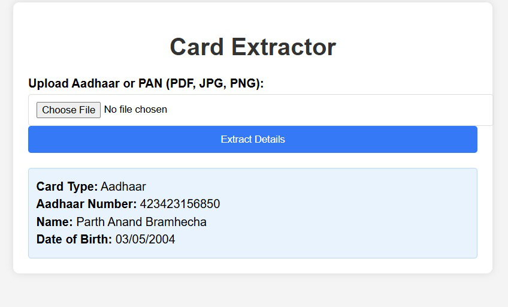

# 📄 Document Scanner Web App

A Flask-based web app that extracts details from Aadhaar and PAN card images using OCR via the OCR.Space API.

---

## 🔍 Overview

This web application leverages **Optical Character Recognition (OCR)** to extract essential details from uploaded images of **Aadhaar** or **PAN** cards. It uses the [OCR.Space API](https://ocr.space/OCRAPI) and provides a simple and user-friendly interface to display the results.

---

## ✨ Features

- 📤 Upload Aadhaar or PAN card images in **JPG**, **JPEG**, or **PNG** formats
- 🔐 Extracts:
  - **Aadhaar**: Name, Aadhaar Number, DOB
  - **PAN**: Name, PAN Number, Father's Name, DOB
- 🛡️ Validates file format and content
- 🌐 Integrates with **OCR.Space API**
- 🖥️ Minimal web UI built with **Flask + HTML**
- ❌ Displays user-friendly error messages for unsupported formats or invalid data

---

## 📦 Requirements

- Python 3.6+
- Flask
- Requests
- python-dotenv
- Werkzeug

---

## ⚙️ Installation

### 1. Clone the Repository

```bash
git clone <repository-url>
cd document-scanner
```

### 2. (Optional) Create a Virtual Environment

```bash
python -m venv venv
source venv/bin/activate  # Windows: venv\Scripts\activate
```

### 3. Install Dependencies

```bash
pip install flask requests python-dotenv werkzeug
```

### 4. Set Up Environment Variables

- Create a `.env` file in the root directory
- Add your OCR.Space API key:

```
OCR_API_KEY=your_ocr_space_api_key
```

> 🔑 [Get your free API key here](https://ocr.space/ocrapi)

### 5. Ensure Upload Directory Exists

The app will automatically create an `uploads/` folder if it doesn't exist.

---

## ▶️ Usage

### 1. Run the Application

```bash
python app.py
```

### 2. Access the Web Interface

Open a browser and go to:  
👉 **http://127.0.0.1:5000**

### 3. Upload Image

- Upload either **Aadhaar** or **PAN** image
- View extracted information or any errors

---

## 🖼️ Screenshot

> Save the following screenshot to `screenshots/card-extractor-screenshot.png`



---

## 📁 File Structure

```
document-scanner/
│
├── app.py                     # Main Flask application
├── templates/
│   └── index.html             # HTML interface
├── uploads/                   # Folder to store uploaded images
├── screenshots/               # Screenshots folder (optional)
├── .env                       # API key (not to be committed)
└── README.md
```

---

## ⚙️ How It Works

### 📁 File Upload

- User uploads Aadhaar or PAN image
- App saves the file and validates format

### 🔎 OCR Processing

- Image is sent to **OCR.Space**
- Extracted text is received in response

### 🧠 Data Extraction

- Regex used to detect Aadhaar/PAN numbers and DOB
- Name/Father’s name extraction via string matching logic

### 📋 Result Display

- Information is rendered on the webpage
- If no valid card is detected → Error message shown

---

## ⚠️ Limitations

- Requires **valid OCR.Space API key**
- Accuracy depends on image quality and OCR performance
- Only supports **JPG**, **JPEG**, **PNG**
- May not extract names accurately from unclear images

---

## 🛡️ Notes

- Keep your `.env` file **private** and **excluded from version control**
- `index.html` in `templates/` is required for the web UI to function
- Debug mode is on by default — **disable in production**

---

## 📝 License

This project is licensed under the [MIT License](LICENSE).

---

> _"Turning images into structured data — fast, simple, and secure."_
